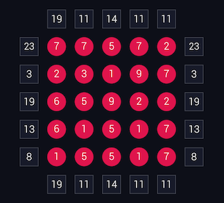

# Rullo Solver

A Rullo puzzle solver that works on all puzzle sizes. 

## Getting Started

### Prerequisites

You'll need to have python_constraint

```
pip install python_constraint
```

### Usage

You'll need a puzzle from the Android game [Rullo](https://play.google.com/store/apps/details?id=air.com.akkad.rullo&hl=en).

Something like this:



You'll need to create to text files.

1. One with the puzzle matrix. (rullo_matrix.txt)
```
7 7 5 7 2
2 3 1 9 7
6 5 9 2 2
6 1 5 1 7
1 5 5 1 7
```

2. The column and row constraints. (rullo_constraints.txt)
First line are the constraints for each columns and second are for the rows.

```
19 11 14 11 11 
23 3 19 13 8	
```

Now, run the script.

```
python rullo_solver.py
```
You'll be asked to type the filename for both the puzzle matrix and the constraints. Leaving the prompts blank will default to the filenames used for the example above. 

```
Filename for puzzle: 
Filename for constraints: 
```

You'll get something like this where the 0s are the deactivated states.

```
[7, 7, 0, 7, 2]
[0, 3, 0, 0, 0]
[6, 0, 9, 2, 2]
[6, 1, 5, 1, 0]
[0, 0, 0, 1, 7]
```


#### Performance

Running times gets longer the bigger the matrix is.
On a 8x8 matrix, I've calculated around 10 seconds before solving while 5x5s are almost instantaneous.


## Acknowledgments

* Inspired by a [Sudoku Solver by ksurya](https://gist.github.com/ksurya/3940679)
